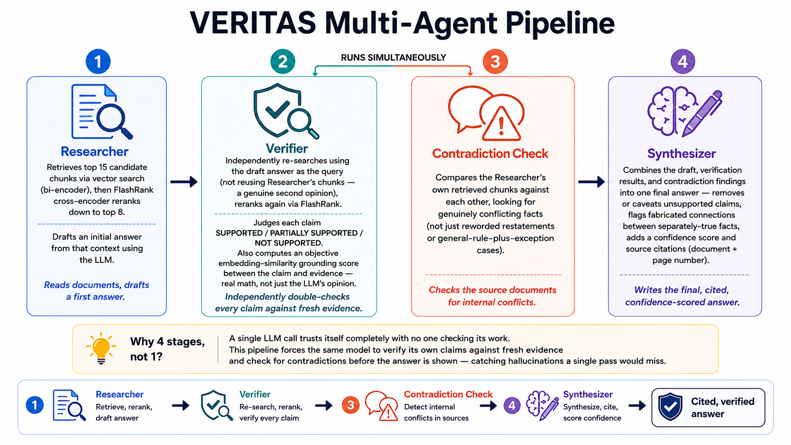
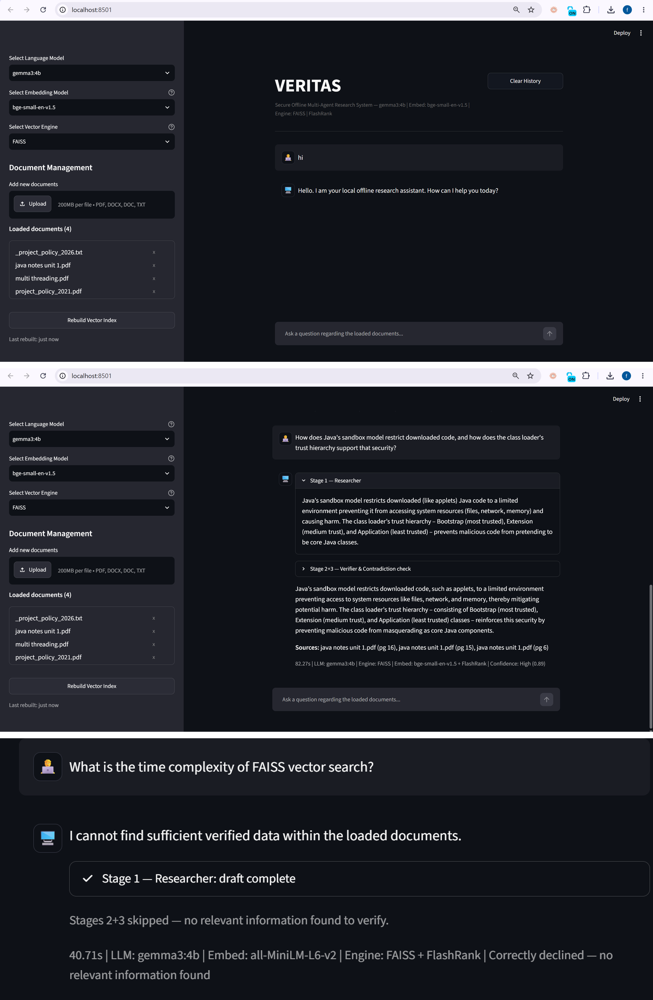

# VERITAS

Secure offline multi-agent research & Fact-Verification system powered by Ollama.
Every answer is researched, independently verified, checked for contradictions, and cited — before you ever see it.

**Veritas** is Latin for _truth_. That's the whole premise of this project: an AI system that doesn't just answer confidently, but actually checks whether it's earned the right to.

---

## Built for

Innova Hack Chapter-1 — Domain 3 (Gen AI), Problem Statement 1 — Team Compil(h)er

> Generative AI tools are powerful researchers but often struggle with hallucination and unverified claims. A system where multiple AI agents check and challenge each other can produce far more trustworthy output than a single model working alone.
>
> Build a multi-agent pipeline where one agent researches a given topic, another cross-verifies claims against multiple sources, a third detects contradictions or hallucinations, and a final agent compiles a citation-backed report — complete with a confidence score for each claim.

---

## What it does

Most AI tools give you an answer and ask you to trust it. VERITAS doesn't work that way.

Upload documents, ask a question, and VERITAS answers using only what's actually in those documents — nothing invented, nothing pulled from the internet, nothing running through a cloud API. But that final answer isn't the whole story. Behind it, several passes happen every single time: the system researches an answer, then independently re-checks that answer against fresh evidence, then separately checks whether the source documents even agree with each other, and only then writes the version you actually see — complete with a confidence score and exact page citations.

Nothing here is trusted blindly, not even by the system's own earlier steps. And unlike most AI tools, none of this happens behind a curtain — every stage's work is visible in the interface, live, as it happens. You're not told to trust the answer. You can watch it get earned.

It runs entirely offline. No document, no query, nothing ever leaves the machine it's running on — which matters most for exactly the kind of documents people are usually most nervous about sharing: internal reports, research papers, anything sensitive enough that uploading it to a cloud AI isn't really an option.

---

## Architecture — four jobs, one model

VERITAS doesn't run four different AI models. It runs one — you choose which (Gemma or Phi, whichever is installed and selected) — but asks that single model to do four different jobs, one after another, each with its own instructions and its own responsibility.



- **Researcher** — reads the retrieved document chunks and drafts a first-pass answer. Fast, direct, not yet trusted by anything downstream.
- **Verifier** — puts on a skeptic's hat. Doesn't take the Researcher's draft at face value — independently searches the documents again, from scratch, using the draft itself as the query, and checks every claim against fresh evidence it found on its own.
- **Contradiction Checker** — runs at the same time as the Verifier, looking for a different failure mode entirely: do the source documents themselves disagree with each other? (Genuinely useful when comparing, say, a 2021 policy against its 2026 update.) Its findings are shown to you directly, in their own section, rather than folded into the final answer's prose — so a borderline flag never quietly reshapes the wording of the actual answer.
- **Synthesizer** — the last word. Reads the draft and the Verifier's findings, removes or caveats anything that didn't hold up, flags any claim that quietly combined two unrelated facts into something that sounds specific but isn't, and writes the final answer — with a confidence score and source citations attached.

No single stage's output is final until something else has checked it.

---

## Tech stack

- **LLM inference:** Ollama (fully local — Gemma 3, Phi-3, or Llama 3.2, selectable)
- **Embeddings:** bge-small-en-v1.5 / all-MiniLM-L6-v2 (selectable, local weights)
- **Vector search:** FAISS / Chroma (selectable, both pre-built together)
- **Reranking:** FlashRank cross-encoder
- **Orchestration:** LangChain
- **Interface:** Streamlit
- **Formats supported:** PDF, DOCX, DOC, TXT

---

## Features

1. **Fully offline** — no internet connection required at any point after initial setup. No document content or query ever leaves the machine.
2. **Multi-agent verification** — not a single LLM call. Multiple distinct passes, each checking the work of the one before it.
3. **Full transparency** — every stage's output is visible in the UI as it runs, not hidden behind a spinner. You see the Researcher's draft, the Verifier's independent check, the Contradiction Checker's findings, and the Synthesizer's final pass, each in its own section.
4. **Objective confidence scoring** — not just the model's self-reported opinion. An independent embedding-similarity check compares each claim against its source evidence mathematically, and can override an overconfident self-score.
5. **Multiple embedding models and vector engines** — all combinations pre-built together on rebuild, so switching between them mid-session is instant, with no reprocessing wait.
6. **Multiple LLMs supported** — any model available through Ollama can be selected and swapped without touching the document index.
7. **Source citations** — every answer ends with the exact document and page number it was drawn from, generated from the retrieved chunks directly, not asked of the LLM (so citations can't be hallucinated).
8. **Contradiction detection with real logic** — not just an LLM asked "any conflicts?" — a structured comparison that distinguishes a genuine factual conflict from a paraphrase, a general-rule-plus-exception, or two unrelated facts sharing a keyword.
9. **Live document management** — upload, delete, and rebuild documents directly from the interface, with automatic reindexing and no manual file handling required.
10. **Graceful failure handling** — corrupted, password-protected, or unreadable files are skipped with a clear warning instead of crashing the app; a damaged index recovers automatically instead of breaking every future session.



---

## How to run

### Prerequisites

- **Ollama** installed and running on your machine, with at least one model pulled (e.g. `ollama pull gemma3:4b`)
- **Docker Desktop** installed, if using Option A. On Windows, Docker Desktop requires **WSL2** (Windows Subsystem for Linux) — if you haven't set this up before, Docker Desktop will prompt you to enable it on first install, or see [Microsoft's WSL2 install guide](https://learn.microsoft.com/en-us/windows/wsl/install). Make sure Docker Desktop is fully started (not just launching) before proceeding.

### Option A — Docker (recommended)

**A1. Build the image yourself:**

```bash
docker build -t veritas .
docker run -p 8501:8501 veritas
```

**A2. Or load the pre-built image** — a `veritas.tar` file is included in this repository, so no build step is needed:

```bash
docker load -i veritas.tar
docker run -p 8501:8501 veritas
```

Either way, Ollama must already be installed and running on your host machine (not inside the container) — the app connects to it over the network. Once the container is running, open `http://localhost:8501` in your browser.

### Option B — Manual setup

```bash
# Install dependencies
pip install -r requirements.txt

# Make sure Ollama is installed and running, with at least one model pulled
ollama pull gemma3:4b

# Run the app
streamlit run streamlit_app.py
```

A `models/` folder with the embedding weights already downloaded is included in this repository — no separate download step needed, the app runs fully offline from the first launch.

---

## Known limitations

- Response time scales with the number of pipeline stages and the size of the chosen models — a full multi-stage answer on larger models can take noticeably longer than a single-pass system.
- Vector engine support currently covers FAISS and Chroma. A third engine (Qdrant) was evaluated but dropped — its local-file locking proved too fragile to fully stabilize, so it was left out rather than shipped unreliable.

---

## Future scope

- **Client/server split** — separating the RAG and inference logic from the interface, so the heavier processing can run on a more powerful machine while a lightweight client connects to it remotely, rather than requiring everything on one device.
- **Multi-agent as callable services** — extending the four current roles (Researcher, Verifier, Contradiction Checker, Synthesizer) into independently callable agents, moving the architecture further in an agentic-AI direction rather than a single sequential pipeline.
- **Additional specialized modes** — task-specific pipelines beyond general Q&A and document comparison, built for distinct use cases rather than duplicating existing functionality.
- **Desktop quick-access app** — a lightweight version triggerable by a global hotkey, for instant access without keeping a browser tab open.

---

**Team:** Compil(h)er
